# AI Team Intern Assignment — The Audit

## Part A — Tokenizer Audit

## A2 — Audit of the Previous Intern's Tokenizer Analysis

---

### Experiment 1 — Reproduce the Previous Intern's Results

#### Question

Is it possible to reproduce tokenizer results reported in `REPORT_v0.md` using provided `fertility.py`, English and Hindi sample corpora, and GPT-2 tokenizer?

#### What needs to be found out

Previous report states:

- English fertility = 1.27 tok/word
- Hindi fertility = 7.45 tok/word
- English tok/char = 0.226
- Hindi tok/char = 1.579
- Hindi/English fertility ratio = 5.89×

#### Method

Run original `fertility.py` as-is.

#### Command

    python fertility.py --corpus corpus/eng_sample.txt --corpus corpus/hin_sample.txt --tokenizer gpt2

#### Result

| Language | Fertility (tok/word) | Tok/char |
|----------|----------------------|----------|
| English  | 1.27                 | 0.226    |
| Hindi    | 7.45                 | 1.579    |

Script outputs:

    hin is 5.89x the fertility of eng (worse tokenization)

The values reported coincide with `REPORT_v0.md`.

#### Conclusion

Baseline tokenizer results reported by the previous intern can be reproduced using provided script, corpora, and GPT-2 tokenizer.

It proves that the reported numbers were obtained via provided methodology. It does not prove yet that the methodology and conclusions are correct.

#### Evidence

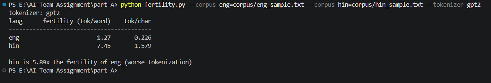

---

### Experiment 2 – Testing `split(" ")` Words Counting

#### Question

Is the `line.split(" ")` method able to calculate words correctly in case there are consecutive spaces?

#### What needs to be found out

In order to calculate the fertility, the following is used:

    words = line.split(" ")

The consecutive spaces can result in an empty string in the resulting list.

The provided English corpus includes the following:

    Please keep the books  in the cupboard.

There are two spaces between `books` and `in`.

#### Method

Compare the results of:

    text.split(" ")

and:

    text.split()

on the same sentence.

#### Command

    python -c "text='Please keep the books  in the cupboard.'; print(text.split(' ')); print(len(text.split(' '))); print(text.split()); print(len(text.split()))"

#### Result

Using `split(" ")`:

    ['Please', 'keep', 'the', 'books', '', 'in', 'the', 'cupboard.']
    8

Using `split()`:

    ['Please', 'keep', 'the', 'books', 'in', 'the', 'cupboard.']
    7

#### Conclusion

`split(" ")` generates an empty value in case of consecutive spaces.

Example:

    split(" ") -> 8 elements
    split()    -> 7 elements

This means that `split(" ")` can result in an incorrect number of words denominator.

#### Evidence

Screenshot 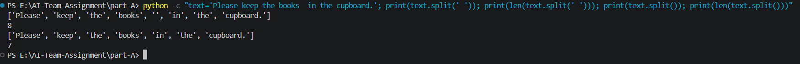

---

### Experiment 3 — Test if the Problem Occurs in the Provided Corpus

#### Question

Is the problem `split(" ")` applicable to the provided English corpus?

#### What needs to be identified

The controlled example illustrated that several spaces in a row may result in an extra word.

The next step is to identify the total word count in the provided English corpus.

#### Method

Calculate the total number of word entries via:

    line.split(" ")

and:

    line.split()

for each line in the provided English corpus.

#### Result

| Method | Total word entries |
|--------|--------------------|
| `split(" ")` | 79 |
| `split()` | 78 |

Difference:

    79 - 78 = 1

Percentage difference in the denominator:

    (1 / 78) × 100 = 1.282%

#### Conclusion

The problem is present in the provided English corpus.

`split(" ")` creates one more word entry and makes the denominator increase by 1.28%.

Further impact on the fertility value needs to be measured.

#### Evidence

Screenshot 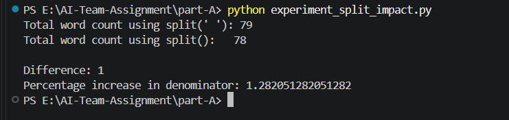

---

### Experiment 4 — Measure the Exact Fertility Impact of `split(" ")`

#### Question

What is the exact fertility effect of the `split(" ")` issue?

#### What needs to be found out

Fertility is calculated in `fertility.py` as follows:

    average(tokens per line / words per line)

So the effect must be measured using this calculation.

#### Method

All other conditions remain the same:

- Same English corpus
- Same GPT-2 tokenizer
- Same NFC normalization
- Same lowercasing
- Same per-line token calculation
- Same 10 lines
- Same averaging method

But the word-splitting is different:

    Original:  line.split(" ")
    Corrected: line.split()

#### Result

| Metric       | Original | Corrected |
|--------------|----------|-----------|
| Fertility    | 1.2652  | 1.2831   |

Difference:

    1.2830627705627706 - 1.2652056277056276
    = 0.017857142857143

Change (%):

    ≈ 1.41%

#### Conclusion

The `split(" ")` problem is really a programming flaw.

In the provided English corpus:

    Original fertility  = 1.2652
    Corrected fertility = 1.2831
    Change               = +1.41%

The additional empty entry inflates the word denominator, thus decreasing the fertility.

This problem is small enough to explain the large difference between English and Hindi fertility.

#### Evidence

Screenshot 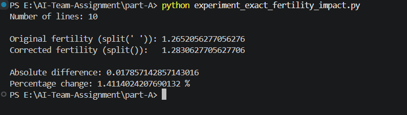

---

### Experiment 5 — Comparison of Average Fertility per Line with Corpus Fertility

#### Question

Is the average of fertility calculated per line significantly different from corpus fertility?

#### What needs to be found out

The `fertility.py` script calculates fertility of each line and then averages it.

The corpus-level fertility is calculated as:

`total tokens / total words`

Both methods have to be compared to find out if the averaging method significantly influences the fertility calculation.

#### Method

For each language:

1. Fertility of each line has to be calculated and averaged.
2. Total number of tokens and total number of words in the corpus has to be counted.
3. The fertility of the whole corpus is calculated as:

   `total tokens / total words`

4. The results have to be compared and the percentage difference should be calculated.

#### Command

    python experiment_macro_micro.py

#### Result

**English**

- Total tokens: 99
- Total words: 79
- Per-line average fertility: 1.2652056277056276
- Corpus-level fertility: 1.2531645569620253
- Difference: 0.012041070743602278
- Percentage difference: 0.9608531199440202%

**Hindi**

- Total tokens: 459
- Total words: 62
- Per-line average fertility: 7.44845238095238
- Corpus-level fertility: 7.403225806451613
- Difference: 0.

#### Conclusion

The per-line average and corpus-level fertility values are slightly different.

The difference is approximately 0.96% for English and 0.61% for Hindi.

The difference is small compared with the large English-Hindi fertility gap. Therefore, the averaging method affects the reported value slightly, but it does not materially explain the large difference in fertility between English and Hindi.

#### Evidence

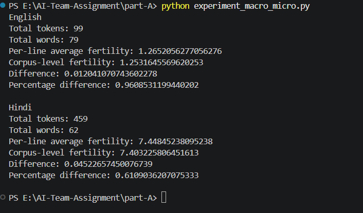
---

### Experiment 6 – Comparing Per-Line Average Fertility to Corpus-Level Fertility

#### Question

Would calculating fertility per line and then averaging it provide a significantly different value from that of the corpus-level fertility?

#### What needs to be found out

Fertility for each line is calculated first, followed by its average through the `fertility.py` script.

Corpus-level fertility calculation involves using:

total tokens / total words

The above calculations need to be compared to see if there is any significant impact of the averaging technique on fertility.

#### Method

For each language:

1. Fertility is calculated per line and then averaged.
2. Total number of tokens and total number of words are calculated for the corpus.
3. Corpus-level fertility is calculated by using:

   total tokens / total words

4. Comparison of the two values and calculating percentage difference.

#### Command

    python experiment_macro_micro.py

#### Result

**English**

- Number of tokens: 99
- Number of words: 79
- Average fertility per line: 1.2652056277056276
- Fertility of the corpus: 1.2531645569620253
- Difference: 0.012041070743602278
- Percentage difference: 0.9608531199440202%

**Hindi**

- Number of tokens: 459
- Number of words: 62
- Average fertility per line: 7.44845238095238
- Fertility of the corpus: 7.403225806451613
- Difference: 0.04522657450076739
- Percentage difference: 0.6109036207075333%

#### Conclusion

There is a slight difference between the per-line fertility and corpus fertility measurements.

The difference amounts to about 0.96% in English and 0.61% in Hindi.

This difference is small considering the big fertility difference between English and Hindi. This means that the averaging technique has little impact on the reported figures.

#### Evidence

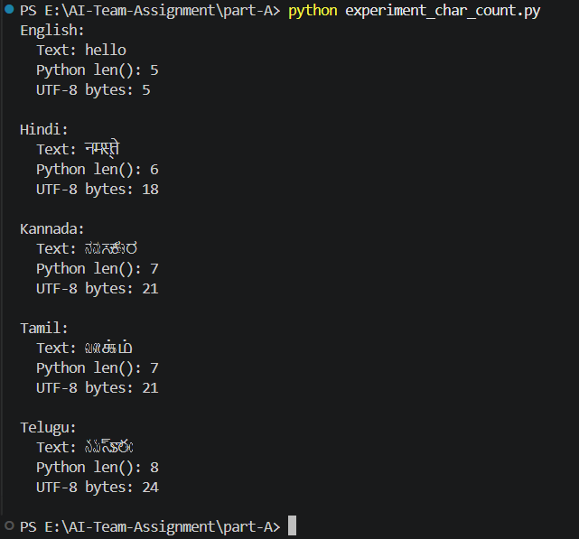

### Experiment 7 — Comparison between Code Points and Grapheme Clusters

#### Question

Is the use of `len(line)` for character count result in a language independent `tok/char` metric?

#### What needs to be investigated

The `fertility.py` script uses `len(line)` for the character count.

In Python `len(line)` counts Unicode code points. The user-perceived character may consist of several Unicode code points.

#### Method

For English and Hindi:

1. Count the total number of tokenizer tokens.
2. Count the number of characters with Python `len(line)`.
3. Count the number of user-perceived characters with grapheme clusters.
4. Calculate:
   
   `tokens / code points`
   
   and
   
   `tokens / grapheme clusters`
5. Compare these two metrics.

#### Command

    python experiment_grapheme_impact.py

#### Results

**English**

- Tokens: 99
- Code points: 448
- Grapheme clusters: 448
- Tok/code point: 0.22098214285714285
- Tok/grapheme: 0.22098214285714285

**Hindi**

- Tokens: 459
- Code points: 290
- Grapheme clusters: 188
- Tok/code point: 1.5827586206896551
- Tok/grapheme: 2.4414893617021276

For English the two denominators are the same.

For Hindi the number of grapheme clusters is significantly less than the number of code points. As a consequence, the metric changes from approximately **1.58 tok/code point to 2.44 tok/grapheme

#### Conclusion

Although the usage of `len(line)` is technically correct in terms of Unicode code points, it is deceptive to use this number as a neutral character count between languages.

With Hindi, the usage of grapheme clusters in the denominator makes a considerable difference in the reported value compared to using code points.

Hence, `tok/char` cannot be considered as a neutral language metric.

#### Evidence

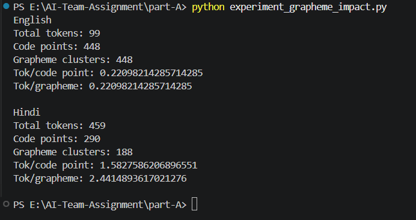

## A2 — Experiment 8: Random Seed Check

### Experiment

Verify if `random.seed(1337)` call in `fertility.py` influences the tokenizer audit outcomes.

### Question

Is the random seed influence on fertility or token-per-character metrics reported by the script?

### What needs to be found out

If removing `random.seed(1337)` influences the outcomes in any way.

### Method

The initial `fertility.py` script was launched using the provided corpus files and GPT-2 tokenizer.

Then the same analysis was conducted without the following line:

    random.seed(1337)

The outputs were compared.

### Result

The outcomes were identical in both cases.

| Language | Initial fertility | Without seed | Initial tok/char | Without seed |
|---|---:|---:|---:|---:|
| English | 1.27 | 1.27 | 0.226 | 0.226 |
| Hindi | 7.45 | 7.45 | 1.579 | 1.579 |

Output comparison:

    Outputs identical: True

### Conclusion

Since there is no random operation performed in the analysis, the `random.seed(1337)` line is irrelevant for the current fertility calculation.

However, the seed is not needed in the current implementation and is not a reason for tokenizer behavior.

### Evidence

- `screenshots/A2_08_seed_check.png` — comparison of outputs with and without `random.seed(1337)`.
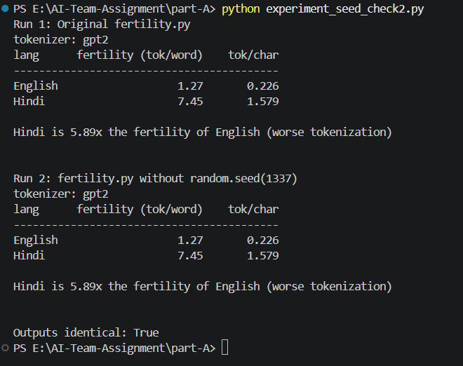

# Part A — Tokenizer Audit

## A1. Proper Multilingual Evaluation Corpus

### Experiment

Build a proper multilingual evaluation corpus for comparing the tokenizer’s behavior across English, Hindi, Kannada, Tamil.

### Question

Does this evaluation corpus have adequate multilingual data in terms of target languages represented and sufficient parallel data for a fair cross-language comparison?

What should have been checked:

1. Does the corpus contain English, Hindi, and 2 Dravidian languages?

2. How many sentences are available per language?

3. How many words and characters are there in each language?

4. What’s the file size of each language’s corpus?

5. Are the sentences placed in the same order across languages?

6. What’s the corpus domain, preprocessing, and limitations?

### Method

I used the FLORES-200 `dev` set of parallel multilingual sentences for evaluation.

The following language files were used:

Language Filename

English eng_Latn.dev

Hindi hin_Deva.dev

Kannada kan_Knda.dev

Tamil tam_Taml.dev

The files were used as is, without any modifications.

The files were read using UTF-8 encoding. The number of lines (sentences) was counted using `splitlines()`. The number of words was counted by splitting on whitespace. The number of characters was counted using Python’s `len()` on the Unicode string. The file sizes were measured in bytes.

By convention, the sentence order is defined by the reference language. To check if all files have sentences in the same order, I compared the first three lines of each file.

### Result

Each of the 4 language files contains 997 sentences:

Language Sentences Words Characters File size (bytes)

en 997 20,954 125,194 126,287

hi 997 24,607 125,383 323,267

kn 997 15,430 131,963 358,653

ta 997 16,134 146,128 399,798

The first three sentences’ positions were cross-checked to ensure that all files have the same sentence order.

I find that the corpus has adequate multilingual data: it covers English plus 2 Dravidian languages (Kannada, Tamil).

The corpus will be used for A3 tokenizer comparison.

### Evidence

`screenshots/A1_2.2_corpus_statistics.png`: Sentence, word, and character counts per language.
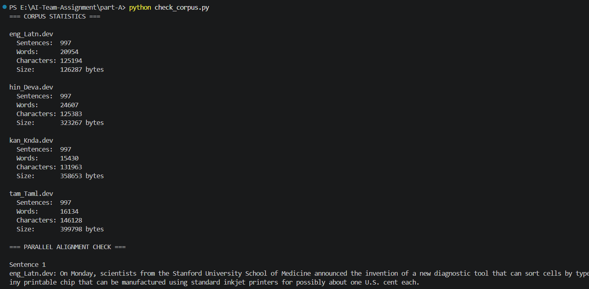

`screenshots/A1_03_parallel_alignment.png`: An example of aligned positions across languages.
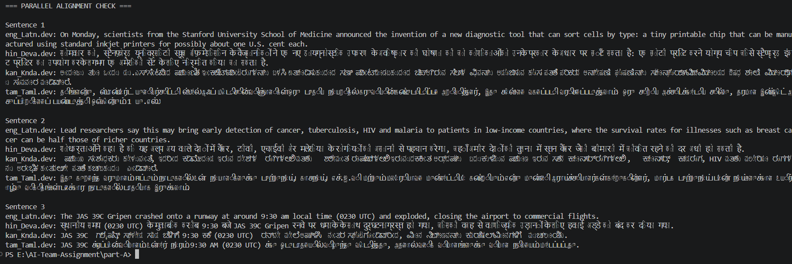

`part-A/check_corpus.py`: Reproducibility: UTF-8 corpus verification script.

### Corpus Domain

The FLORES-200 benchmark is based on Wikipedia articles translated into various languages. Therefore, the `dev` set represents a multilingual general-domain corpus.

### Preprocessing

No modifications were made to the original FLORES files. For verification purposes, files were decoded using UTF-8. Line-endings were used to separate sentences. Words were separated by whitespace, and characters were counted using Python’s built-in `len()` function.

No additional translation, filtering, shuffling, or manual editing was performed.

### Limitations

1. Due to the nature of this benchmark, the corpus only has 997 sentences per language in the `dev` set. It has been used for evaluation purposes only.

2. The corpus only covers general domains (Wikipedia articles) and does not attempt to represent all possible domains or languages.

3. Word and character counts may be affected by the choice of denominator (whitespace vs. Unicode code-points).

4. While the sentences are parallel, the languages may have different syntactic structures and sentence lengths.

## A3. Comparison between Cross-Language Tokenizer

### Experiment

Compare a general tokenizer and multilingual tokenizer which targets Indic languages on the correct multilingual FLORES-200 evaluation corpus.

### Question

How does the choice of the tokenizer influence tokenization in English, Hindi, Kannada, and Tamil languages, and what metric should be used for routing and costs?

### What needs to be found out

- Whether the GPT-2 tokenizer works differently from the Indic tokenizer.
- Token counts for the same multilingual corpus.
- Tokenization performance with various denominators.
- Whether this difference is stable in the entire corpus.
- Which single metric is more valuable for routing and cost decisions.

### Method

FLORES-200 `dev` split from A1 was utilized without any changes in the corpus.

Two tokenizers were chosen:

- GPT-2 tokenizer with `tiktoken`.
- MuRIL tokenizer with `transformers`.

At first, `ai4bharat/indic-bert` tokenizer was attempted to utilize, however, Hugging Face repository required authentication and threw 401 gated-repository error. Therefore, this tokenizer was not utilized in the experiments. MuRIL tokenizer was chosen due to its successful loading.

For each language both tokenizers were run for the same 997 sentences.

MuRIL tokenizer did not require any special tokens.

### A3-1 — Tokenizer Verification

#### Experiment

Test both tokenizers to check whether they are able to load and tokenize all the four languages.

#### Question

Is it possible to successfully tokenize the English, Hindi, Kannada, and Tamil corpus with GPT-2 and MuRIL?

#### Method

Load each tokenizer and tokenize all 997 sentences for each of the four languages.

#### Result

Both tokenizers have been loaded and have processed all four language files.

| Language | Sentences | GPT-2 tokens | MuRIL tokens |
|---|---|---|---|
| English | 997 | 25,741 | 26,365 |
| Hindi | 997 | 191,602 | 30,731 |
| Kannada | 997 | 350,019 | 27,978 |
| Tamil | 997 | 397,169 | 27,792 |

#### Conclusion

It is possible for both tokenizers to process the full evaluation corpus. Since the initial IndicBERT tokenizer could not be used due to the gated repository, MuRIL has been used as the Indic tokenizer.

#### Evidence

- `screenshots/A3_01_tokenizer_verification.png`
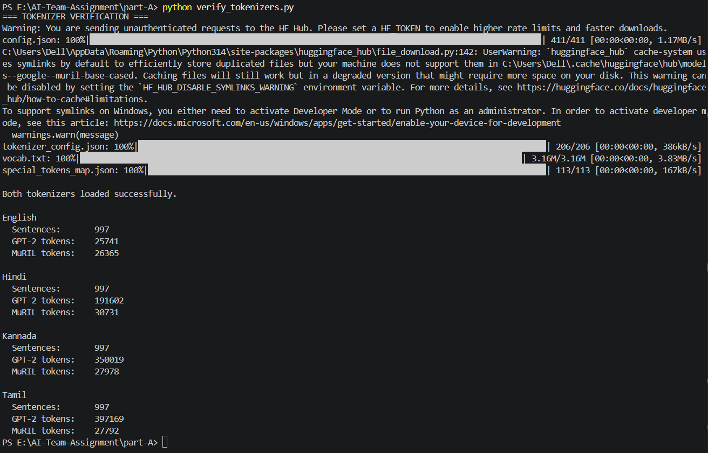
- `part-A/

---

### A3-2 — Tokens per Word

#### Experiment

Count tokenizer outputs based on the number of words.

#### Question

What is the ratio of tokens produced per whitespace-separated word by each tokenizer?

#### What needs to be found out

If the difference between the tokenizers in terms of total number of tokens persists when considering the ratio of tokens per word.

#### Method

For each language:

    tokens per word = total tokenizer tokens / total whitespace-separated words
    
The same corpus and the same number of words were used for both tokenizers.

#### Result

| Language | GPT-2 tok/word | MuRIL tok/word |
|---|---:|---:|
| English | 1.2285 | 1.2582 |
| Hindi | 7.7865 | 1.2489 |
| Kannada | 22.6843 | 1.8132 |
| Tamil | 24.6169 | 1.7226 |

#### Conclusion

The two tokenizers are similar in their behaviour with English, but GPT-2 is significantly more costly than MuRIL for Hindi, Kannada and Tamil in terms of tokens per word.

While tokens per word can give us insight into how tokenizers behave in relation to the linguistic words, it is not directly a production cost measure.

#### Evidence

- `screenshots/A3_02_tokenizer_comparison(per words).png`
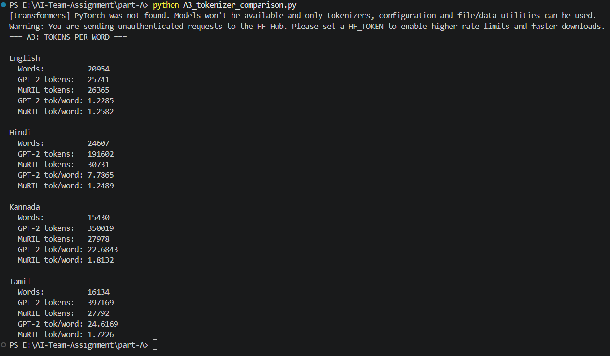
- `part-A/a3_tokenizer_comparison.py`

---

### A3-3 — Tokens per Grapheme

#### Experiment

Compute tokenizer results using Unicode grapheme clusters as the denominator.

#### Question

Is the tokenizer difference present when text length is computed using perceived user characters as opposed to words?

#### What needs to be found out

Whether the large Indic language difference is based on the choice of the denominator.

#### Method

Unicode grapheme clusters were extracted using the Unicode aware `regex` package with `\X`.

For each language:

    tokens per grapheme = total tokenizer tokens / total grapheme clusters

#### Result

| Language | GPT-2 tok/grapheme | MuRIL tok/grapheme |
|---|---:|---:|
| English | 0.2056 | 0.2106 |
| Hindi | 2.3247 | 0.3729 |
| Kannada | 4.0524 | 0.3239 |
| Tamil | 4.2043 | 0.2942 |

#### Conclusion

The tokenizer difference remains significant even after normalization with grapheme clusters.

GPT-2 and MuRIL are comparable in English; however, for Hindi, Kannada, and Tamil, GPT-2 yields significantly higher token count than MuRIL per grapheme cluster.

This is also relevant to A2, where it was demonstrated that Unicode code points and grapheme clusters generate different results for Indic languages.

#### Evidence

- `screenshots/A3_03_tokenizer_comparision_grapheme_clusters.png`
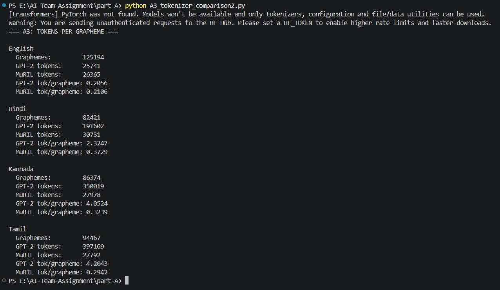
- `part-A/a3_tokenizer_comparison2.py`

---

### A3-4 — Tokens per Parallel Sentence

#### Experiment

Token counts per aligned sentence measured.

#### Question

How many tokens does each tokenizer need for the same parallel sentence set?

#### What needs to be found out

If the tokenizer difference can be seen in the same parallel evaluation unit not through words or graphemes but directly.

#### Method

Each language contains 997 parallel sentences.

For each tokenizer:

    tokens per sentence = total tokens / 997

GPT-2 to MuRIL ratio was also calculated.

#### Result

| Language | GPT-2 tok/sentence | MuRIL tok/sentence | GPT-2 / MuRIL |
|---|---:|---:|---:|
| English | 25.82 | 26.44 | 0.98x |
| Hindi | 192.18 | 30.82 | 6.23x |
| Kannada | 351.07 | 28.06 | 12.51x |
| Tamil | 398.36 | 27.88 | 14.29x |

#### Conclusion

Tokenizer difference can be seen in the same parallel sentence unit comparison.

For Hindi, Kannada, and Tamil languages, GPT-2 needs substantially more tokens compared to MuRIL for the same sentence set. For English there is almost no difference.

#### Evidence

- `screenshots/A3_04_tokens_per_sentence.png`
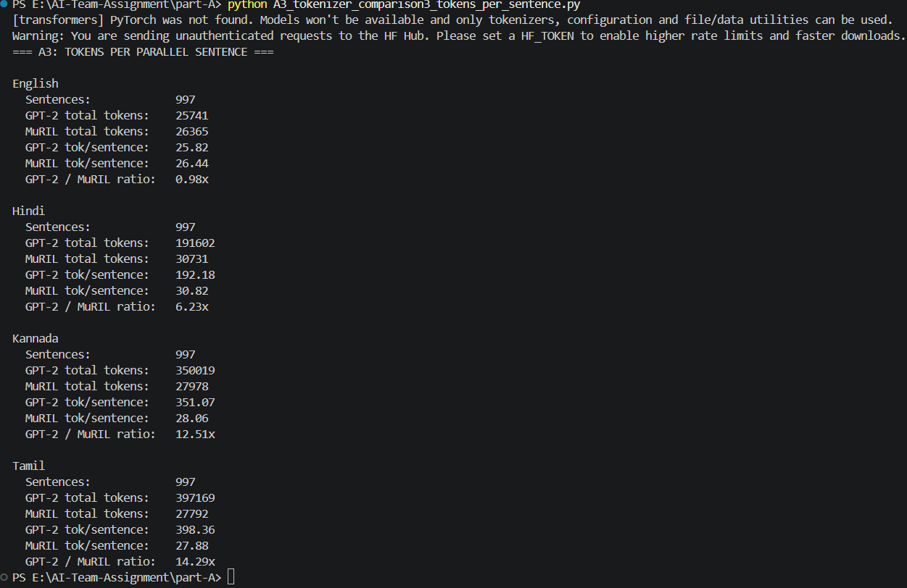
- `part-A/a3_tokenizer_comparison3_tokens_per_sentence.py`

---

### A3-5 — Percentage Token Reduction

#### Experiment

Compute the percentage reduction in token count from using MuRIL rather than GPT-2.

#### Question

How big is the difference in token counts between the two tokenizers?

#### What needs to be found out

Whether the tokenizer difference is sufficiently big to matter in practice for Indic-language queries.

#### Method

For each language:

    token reduction (%) =
    (GPT-2 tokens - MuRIL tokens) / GPT-2 tokens × 100

#### Result

| Language | GPT-2 tokens | MuRIL tokens | MuRIL change |
|---|---:|---:|---:|
| English | 25,741 | 26,365 | 2.42% increase |
| Hindi | 191,602 | 30,731 | 83.96% reduction |
| Kannada | 350,019 | 27,978 | 92.01% reduction |
| Tamil | 397,169 | 27,792 | 93.00% reduction |

The English value of -2.42% in the above calculation represents an increase of 2.42% in MuRIL token count.

#### Conclusion

MuRIL generates significantly fewer tokens in the case of the three Indic languages in the corpus, although slightly more tokens are generated for English.

In this corpus, the largest reduction seen is for Tamil at 93.00%.

Token reduction does not equate to an identical percentage reduction in GPU cost since serving cost will depend on several factors such as the model used, hardware used, batch size, sequence length, and serving parameters.

#### Evidence

- `screenshots/A3_05_token_reduction.png`
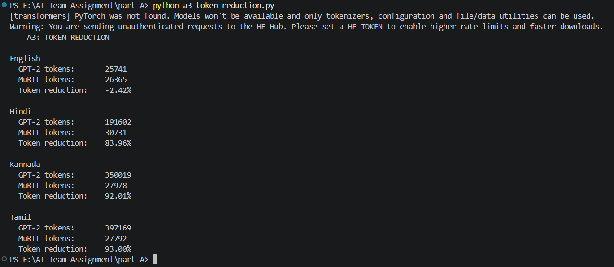
- `part-A/a3_token_reduction.py`

---

### A3-6 — Tokens per Sentence Distribution

#### Experiment

Calculate tokens distribution per sentence.

#### Question

Are tokens per sentence values predominantly determined by a few very long sentences?

#### What needs to be found out

Whether tokenizer difference is manifested by median and range, in addition to the mean value.

#### Method

For each sentence, the amount of tokens was calculated independently for both GPT-2 and MuRIL tokenizers.

Minimum, maximum, mean and median values were then calculated.

#### Result

| Language   | Tokenizer | Min | Median | Mean     | Max  |
|------------|-----------|-----|--------|----------|------|
| English    | GPT-2     | 7   | 25     | 25.82    | 65   |
| English    | MuRIL     | 7   | 25     | 26.44    | 66   |
| Hindi      | GPT-2     | 48  | 185    | 192.18   | 561  |
| Hindi      | MuRIL     | 9   | 30     | 30.82    | 88   |
| Kannada    | GPT-2     | 90  | 336    | 351.07   | 883  |
| Kannada    | MuRIL     | 7   | 27     | 28.06    | 77   |
| Tamil      | GPT-2     | 84  | 386    | 398.36   | 994  |
| Tamil      | MuRIL     | 5   | 27     | 27.88    | 71   |

#### Conclusion

The large difference between Indic languages does not result from just a few sentences.

For instance, median values for Tamil differ as much as 386 tokens for GPT-2 and 27 tokens for MuRIL. A similar situation is observed for Kannada language, where medians are 336 and 27 tokens correspondingly.

This proves that the difference in tokenization is not just a result of several outliers.

#### Evidence

- `screenshots/A3_06_token_distribution.png`
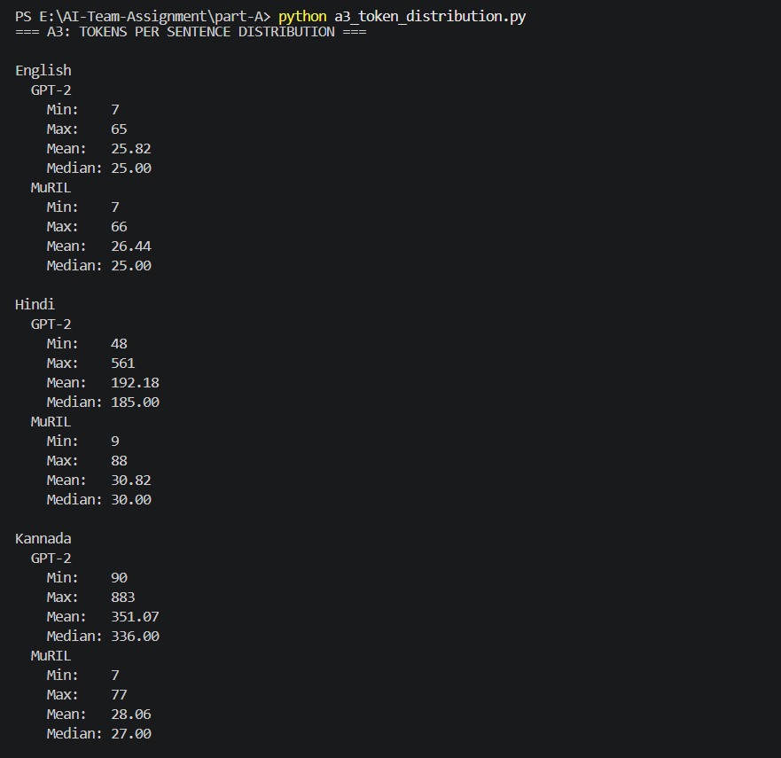

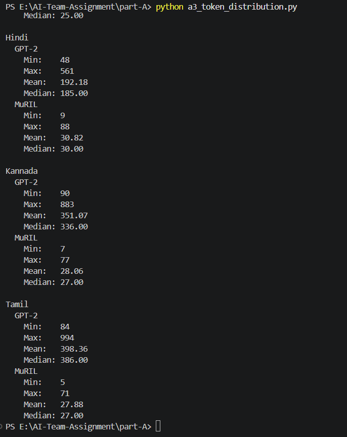

- `part-A/a3_token_reduction.py`

---

### A3 Final Comparison

Three different denominators provide different information:

| Metric | Purpose |
|---|---|
| Tokens per word | Token count normalized to linguistic words |
| Tokens per grapheme | Token count normalized to user-perceived text units |
| Tokens per parallel sentence | Same aligned evaluation unit comparison |

As we can see from the normalized metrics, the large GPT-2 tokenization overhead for Indic languages is present irrespective of which denominator we choose.

### Routing and Cost Recommendation

The single number that should be used for routing and cost calculation purposes is:

**Number of tokens produced by the tokenizer of the model to serve the request.**

Word and grapheme counts can be helpful in offline tokenizer analyses, but the model operates with its own token sequence.

For example, in a 997 sentence Tamil corpus:

- GPT-2: 397,169 tokens
- MuRIL: 27,792 tokens

Thus, the tokenizer-specific token count becomes a relevant measure to estimate the sequence length and token-based cost of running the model.

Nevertheless, token counts obtained using different tokenizers should not be considered the same units of compute.

### A3 Overall Conclusion

The comparison indicates that the selection of tokenizer makes a significant difference in Indic language token counts.

GPT-2 and MuRIL token counts are comparable for English, whereas MuRIL has significantly lower token counts for Hindi, Kannada, and Tamil from the FLORES-200 `dev` set.

The finding is stable in terms of number of tokens per word, tokens per grapheme, and tokens per parallel sentence.

For production purposes and cost calculation, the token count of the models themselves is the main metric, and the number of tokens per word and grapheme needs to be kept for diagnostic purposes.

## B1 — KV-Cache Capacity Estimation

### Experiment

Estimate the necessary memory per token of the KV-cache and find out how many simultaneous 4096-token sequences fit into the configured GPU.

### Question

Is the memory usage consistent with the model specification and what was observed in the serving benchmark?

### What needs to be found out

KV-cache memory bytes per token, the approximate maximal number of 4096-token sequences, and if the estimation matches the serving benchmark.

### Method

From the model specification:

- Layers = 28
- KV heads = 8
- Head dimension = 128
- KV cache precision = FP16 = 2 bytes/value
- GPU memory = 24 GB
- GPU memory utilization = 0.92
- Non-KV runtime overhead ≈ 1.6 GB

Since the KV-cache contains both K and V, its size will be equal to:

    KV bytes/token
    = 2 × layers × KV heads × head_dim × bytes/value
    = 2 × 28 × 8 × 128 × 2
    = 114,688 bytes/token

For 4096 tokens in a sequence, that makes:

    114,688 × 4096
    = 469,762,048 bytes
    ≈ 448 MiB

Approximated memory that can be used for KV-cache:

    24 GB × 0.92 − 1.6 GB
    = 20.48 GB

Approximate maximum number of 4096-token sequences:

    20.48 GB / 0.4698 GB
    ≈ 43.6

So the approximate capacity is 43 sequences of 4096 tokens.

### Result

Benchmark log has the following KV-cache utilization values with prompt_len = 3584 and gen_len = 512 (4096 tokens per sequence):

| Batch size | KV cache utilization | Preempted sequences |
|---:|---:|---:|
| 16 | 0.62 | 0 |
| 24 | 0.93 | 0 |
| 32 | 0.97 | 7 |
| 48 | 0.97 | 23 |

KV-cache utilization starts to be high starting from batch 24 and becomes equal to 0.97 for batch sizes 32 and 48. Preemption also starts to occur from batch 32 and increases for batch 48.

### Conclusion

Capacity of KV-cache is estimated to be around 43 fully loaded 4096-token sequences using simplified memory model. However, the benchmarking results indicate that KV-cache pressure happens before this value, since KV-cache utilization is 0.93 for batch 24 and preempted sequences appear on batch 32.

It's expected to have some gap between theoretical estimate and actual result due to approximations in calculation and lack of accounting of serving allocator overheads, block granularity and scheduling and other factors.

### Evidence

- `screenshots/B1_kv_cache_log.png` — rows of the benchmark with KV-cache utilization and preemptions.
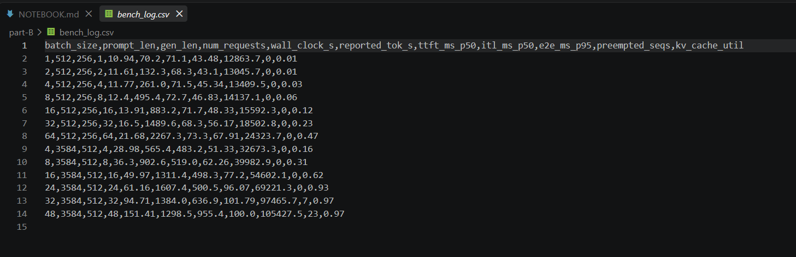
- `part-B/model_spec.md` — model and GPU specifications.
- `part-B/bench_log.csv` — benchmarking results.

## B2 — 3584-Prompt Batch Scaling Anomaly

### Experiment

Examine 3584-prompt benchmark sweep to understand why throughput scaling is not observed with batch size increase.

### Question

What causes the throughput drop when batch size increases from 24 to 32?

### What needs to be found out

Whether the throughput drop is connected to KV-cache pressure and sequence preemptions.

### Method

Compare the batch 16, 24, 32, and 48 in terms of reported throughput, KV-cache utilization, preempted sequences, ITL and E2E latencies.

The linearly scaled throughput value for batch 32 by using batch 24 throughput is:

    1607.4 × (32 / 24) = 2143.2 tok/s

Batch-32 throughput is equal to 1384.0 tok/s and it is 35.4% lower than naive throughput estimate.

### Result

| Batch | Reported tok/s | KV util | Preempted | ITL p50 (ms) |
|---:|---:|---:|---:|---:|
| 16 | 1311.4 | 0.62 | 0 | 77.2 |
| 24 | 1607.4 | 0.93 | 0 | 96.07 |
| 32 | 1384.0 | 0.97 | 7 | 101.79 |

### Conclusion

Throughput does not scale linearly beyond batch 24. At batch 32, KV-cache utilization is near saturation and preemptions appear, while ITL increases. This supports KV-cache pressure and scheduler preemption as the likely mechanism.

A practical deployment change is to cap this long-prompt workload at batch 24. Compared with batch 32, the observed throughput at batch 24 is 16.1% higher and has zero preemptions.

### Evidence

- `screenshots/B2_prompt3584_anomaly.png`

- `part-B/bench_log.csv`

## B3 – Clarifying the Misleading Throughput Report

### Experiment

Validate whether the reported throughput metric refers to generated-token goodput.

### Question

What made the old report misleadingly conclude that longer prompts yield higher throughputs and that batch 48 achieves around 3200 tok/s?

### What needs to be found out

Figure out the column that has been interpreted wrongly and compute the true generated-token goodput of the batch-24-long-prompt experiment independently twice.

### Method

For batch size 24, prompt_len = 3584 and gen_len = 512:

    Generated tokens = 24 × 512
                     = 12,288 tokens

With the metric of dividing the generated tokens by the wall clock:

    12,288 / 61.16
    ≈ 200.9 generated tok/s

We can obtain the same answer by first determining the number of seconds per generated token and then taking the reciprocal of that value:

    61.16 / 12,288 ≈ 0.004974 s/token

    1 / 0.004974 ≈ 200.9 generated tok/s

As the reported throughput metric gives a value of 1607.4 tok/s. The reported throughput value comes from computing prompt+generated tokens:

    24 × (3584 + 512) / 61.16
    ≈ 1607.4 tok/s

Thus `reported_tok_s counts prompt + generated tokens rather than generated output tokens alone.

### Result

The honest generated-token goodput for the batch-24 long-prompt experiment is approximately **200.9 generated tok/s**, whereas the harness reports **1607.4 tok/s**.

The reported value is approximately eight times higher since:

    (3584 + 512) / 512 = 8

Therefore, using the reported tok/s as the generated-token throughput would make longer prompts look artificially good.

### Conclusion

The old report incorrectly assumes that the `reported_tok_s` column gives the generated-token throughput. The counter contains both prompt tokens and generated tokens.

In the case of the batch-24 long-prompt experiment, the honest generated-token goodput is approximately **200.9 tok/s**, not 1607.4 tok/s. Hence, the claim about longer prompts giving better throughput cannot be substantiated with this counter.

The reported batch-48 value should not be considered as generated-output goodput either.

## B4 — Production Metric for Confirming the B2 Mechanism

### Experiment

Choose a single serving-stack metric that would validate the suggested KV-cache pressure and preemption issue.

### Question

Which production metric would give a direct confirmation that KV-cache pressure leads to throughput degradation?

### What needs to be found out

Metric which would measure either the preemptions or additional work caused by preemption.

### Method

Observe the KV-cache preemption/recomputation counter of the serving stack, ideally - the token recomputations following the preemptions.

The B2 benchmark gives us an indication of what should be observed:

    Batch 24 → 0 preempted sequences
    Batch 32 → 7 preempted sequences
    Batch 48 → 23 preempted sequences

### Result

The chosen metric is the **KV-cache preemption/recomputation count**.

Expected behavior of this metric on production would be to stay close to zero when using safe batch sizes and increase when approaching the KV-cache utilization saturation point and starting to have preemptions.

Exact recomputation count cannot be estimated from the provided benchmark since this counter is not present in the `bench_log.csv` file.

### Conclusion

KV-cache preemption/recomputation counter would give a direct validation of the B2 hypothesis. An increase of this metric along with KV-cache utilization saturation and throughput decrease is the evidence of preemption issue.

# Part C – Casualization Strategy Memo

## Decision

First, use a prompt-only solution as the starting point on Day-1. If it does not reach the required quality bar, evaluate SFT as an alternative approach. Consider using a ≤1B rewriter only if SFT fails to offer a better quality/price/latency trade-off.

## Assumptions

- Target languages: Hindi, Kannada, Tamil, Telugu, Bengali, and Marathi.
- Availability of one reviewer for 10 hours/week who can review in Hindi and Kannada.
- Time taken per review is 2 minutes per example.
- For SFT preparation, consider 1,000 synthetic examples (formal-to-casual pair per language). This is a planning assumption, not data requirement.
- An approach is considered successful if ≥80% of reviewed outputs have desired casual tone and ≥95% retain the original meaning.

## Back-of-the-Envelope Calculations

Reviewer throughput:

    10 hours/week × 60 = 600 minutes/week

    600 / 2 = 300 evaluations/week

In 3 weeks:

    300 × 3 = 900 evaluations

The planned initial day-1 evaluation of 50 Hindi and 50 Kannada examples, i.e., 100 examples:

    100 × 2 = 200 minutes
    = 3.3 reviewer-hours

For SFT, the planning data set size is:

    1,000 pairs/language × 6 languages
    = 6,000 synthetic pairs

The training compute available is 1×A100-80GB for 2 weeks. It is impossible to calculate the exact dollar training cost from the available information because the cloud pricing or the throughput per unit time is not available. For the ≤1B rewriter, an inference step will be involved, thereby adding to the serving compute latency. Prompt only adds no cost for model training.

## Option Comparison

| Approach | Cost/effort | Key advantage | Key disadvantage |
|---|---|---|---|
| Prompt-only | Lowest | Instant and no new model | Does not necessarily address the style issue |
| ≤1B rewriter | Medium | Main model stays the same | Additional latency/processing and meaning modifications |
| SFT | Highest | Modification of the main model behavior | Data requirement, training and evaluation |

## Day-1 Experiment

Generate 100 cases for evaluation: 50 Hindi and 50 Kannada.

For each case, compare the output of the baseline with prompt-only casual version. If there is a rewriter or SFT pilot, then use the same set of cases for their comparison.

The evaluator evaluates:

1. The ability of the output to be in the required casual style.
2. Whether the original meaning was kept.

The first and main success criterion is at least 80% pass rate on the style and 95% pass rate on meaning preservation.

## Kill Criterion

If an approach fails one of the thresholds above in the Day-1 experiment, do not waste the remaining compute budget on scaling the approach. Try another approach instead.

## Recommendation

Prompt-only should be tried first since it does not incur extra training or serving costs.

If prompt-only fails to meet the quality requirements, SFT pilot would be the way forward since it involves modifying the behavior of the original assistant rather than introducing another inference step, which might be sub-optimal. The ≤1B rewriter would be the other choice as long as the quality, preservation, latency, and serving costs measure up to the SFT choice.

One concern to note is that the reviewer only covers Hindi and Kannada; thus, any quality claims on the four other languages need verification before launch.